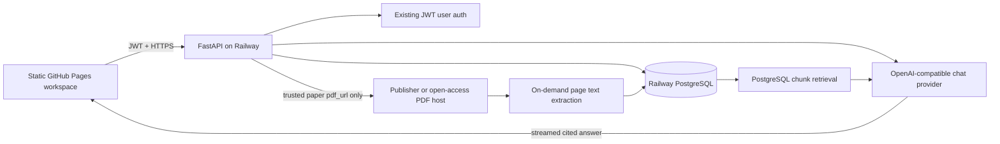

# Chat with Paper — Implementation Plan

## 1. Outcome

Add an authenticated **Chat with Paper** workspace to ResearchScope. When a user selects a paper, ResearchScope opens one responsive workspace containing:

- the paper/PDF on the left;
- a grounded assistant on the right;
- page-linked citations in every answer;
- new-chat and per-paper history controls;
- user-owned, cross-device conversation history and usage tracking.

The visual reference is a product-direction reference, not a pixel-copy target. The workspace must use ResearchScope's existing navigation, colors, spacing, dark mode, typography, cards, borders, and authentication patterns.

This document is a plan only. It does not implement the feature.

---

## 2. Planning principles

The requested `grill-me` and `karpathy` skills are not installed in the available Codex skill catalog. This plan applies their intended disciplines explicitly:

- **Grill the assumptions:** identify unresolved product, legal, cost, retrieval, and UX decisions before implementation.
- **Keep the first version small:** use the existing FastAPI app, PostgreSQL database, JWT auth, static frontend, and direct `httpx` provider calls.
- **Prefer measurable behavior:** answers must be grounded, citations must resolve to stored chunks/pages, ownership must be enforced, and token usage must be recorded.
- **Avoid premature infrastructure:** begin with PostgreSQL full-text retrieval and on-demand extraction. Add embeddings, a vector database, or a separate worker only when evaluation or load proves they are needed.
- **Always retain a failure path:** if a PDF cannot be prepared or the LLM is unavailable, the user still sees the paper metadata, PDF/external link, and a clear status rather than a broken page.

---

## 3. Codebase scan findings

### Current architecture

- `site/` is a no-build static frontend deployed through GitHub Pages.
- `backend/app/` is a FastAPI service deployed on Railway.
- Railway PostgreSQL stores papers, users, favourites, and favourite notes.
- JWT auth already identifies a user with `get_current_user`.
- The browser stores the JWT and cached user object in `localStorage` through `site/assets/js/railway-api.js`.
- `site/assets/css/style.css` defines the shared `--rs-*` design tokens, light/dark themes, navigation, cards, tables, inputs, badges, responsive behavior, and loading states.
- Paper rendering is duplicated across `papers.html`, `conferences.html`, `journals.html`, `search.html`, `topics.html`, `index.html`, and the library scripts.
- Paper titles currently open the external `paper_url` in a new tab. There is no internal paper-detail route.
- `GET /papers/{paper_id}` already returns one paper's metadata.
- `src/fulltext/` already contains batch-oriented PDF URL resolution, GROBID extraction, and section segmentation for a Hugging Face training dataset. It is not connected to the FastAPI runtime or PostgreSQL chat storage.
- The backend currently has no LLM service, embeddings, document chunks, conversations, chat messages, streaming response path, rate limiting, or chat tests.
- The current `backend/requirements.txt` already has `httpx` but has no PDF parser or tokenizer.
- The current database initialization relies on SQLAlchemy `create_all()` plus small idempotent SQL additions; there is no Alembic migration framework.
- The README explicitly says ResearchScope stores only bibliographic metadata and not PDFs/full text. Persisting extracted chunks changes that promise and requires a deliberate policy update.
- The connected local Railway database contained zero paper and user rows during this scan. Feature tests therefore need deterministic fixtures and must not depend on that database being populated.

### Existing code to reuse

| Concern | Existing surface to reuse |
|---|---|
| Paper metadata | `backend/app/models.py`, `backend/app/routers/papers.py`, `PaperOut` |
| User ownership | `User`, JWT bearer auth, `get_current_user` |
| Browser API client | `_apiFetch()` and `window._rs_api` in `railway-api.js` |
| Theme and visual language | `style.css` and `app.js` |
| PDF source knowledge | `src/fulltext/pdf_resolver.py` |
| PDF/section concepts | `src/fulltext/builder.py`, `grobid_client.py`, `segmenter.py` |
| User-menu entry points | `_showUserMenu()` in `railway-api.js` |
| Per-user notes precedent | `Favourite.notes` and `/favourites/{paper_id}/notes` |
| Frontend unit-test pattern | Node tests wrapped by Pytest under `tests/frontend/` |

### Important boundaries

- Do not send provider keys to the static frontend.
- Do not let the client submit an arbitrary PDF URL; the backend must resolve it from the trusted `papers` row.
- Do not make chat state localStorage-only. The requirement to track by user means sessions and messages must be owned by the authenticated database user.
- Do not replace explicit external `Paper` and `PDF` links. Title clicks can enter the workspace while secondary links continue opening the publisher/PDF directly.
- Do not pre-process the entire 100K+ corpus for the MVP. Prepare papers on demand and cache successful extraction.

---

## 4. Product assumptions to challenge before implementation

These are the recommended defaults. A different answer changes scope and should be decided before coding the affected phase.

| Question | Recommended default | Why it matters |
|---|---|---|
| Does “two windows” mean two browser windows? | No. Use one split-pane workspace. | Separate browser windows are hard to coordinate and poor on mobile. |
| Must a user sign in? | Viewing is public; sending a message requires sign-in. | This preserves ResearchScope's public browsing while making chat history attributable and enforceable. |
| What does “track by user” mean? | Persist sessions, messages, timestamps, paper, model, token counts, and user-visible history. | Gives cross-device continuity and supports quotas without hidden behavioral surveillance. |
| Should anonymous chats be saved? | No. Keep only unsent composer text in `sessionStorage`. | Avoids an identity merge problem and unowned database records. |
| Should the assistant answer from outside knowledge? | No by default. Answer from the paper, clearly label metadata, and say when evidence is absent. | Prevents a generic chatbot from masquerading as paper-grounded assistance. |
| Should PDFs be permanently stored? | No. Discard PDF bytes after extraction; retain page-aware text chunks only under an approved retention policy. | Reduces storage and licensing risk. |
| What if a paper has no usable PDF? | Offer abstract-only chat with a visible “Abstract only” badge, or disable chat if even the abstract is missing. | A large multi-source corpus will never have 100% retrievable PDFs. |
| Is “Highlight & Ask” part of MVP? | No; add it after the split workspace and cited chat are stable. | Native cross-origin PDF viewers do not expose selection to the parent page. It requires PDF.js/proxy work. |
| Which model/provider? | Use a server-side OpenAI-compatible provider adapter via `httpx`; the repo's prior preference is Groq, but the model remains environment-configured. | Avoids an SDK and vendor lock-in while keeping keys server-side. |
| Do we need embeddings immediately? | No. Start with page-aware chunks and PostgreSQL full-text ranking; evaluate retrieval before pgvector. | Keeps the MVP inside existing infrastructure. |
| How long is history retained? | Recommend user-controlled deletion plus a documented 90-day inactive-session retention policy. | This is a privacy and cost decision, not an implementation detail. |
| Can ResearchScope retain extracted text? | Treat as a launch-blocking legal/data-policy decision. | The current public promise says metadata only. |

### Launch blockers requiring an explicit decision

1. Approve a policy for fetching and retaining extracted text from third-party PDFs.
2. Choose the LLM provider account, model, budget, and daily per-user quota.
3. Confirm whether abstract-only fallback is allowed.
4. Confirm the session-retention period and whether users need export as well as deletion.

---

## 5. Target user experience

### Entry behavior

1. A paper title click navigates to `chat-paper?id=<encoded-paper-id>`.
2. Explicit `Paper` and `PDF` links remain external links.
3. The workspace loads paper metadata through `GET /papers/{paper_id}`.
4. If signed in, the page loads the user's most recent session for this paper or creates one when the user sends the first message.
5. If not signed in, the paper remains viewable but the composer displays a sign-in call to action.
6. PDF preparation starts on demand and shows `Preparing paper…`, `Ready`, `Abstract only`, or a recoverable error state.

### Desktop layout

- Reuse the existing ResearchScope top navigation.
- Below the nav, use a viewport-height two-pane layout.
- Left pane: paper title, authors/venue metadata, source/PDF controls, preparation state, and the PDF viewer.
- Right pane: `Assistant` and `History` tabs, `New chat`, messages, citations, suggested questions, and a fixed composer.
- Start near 60% paper / 40% assistant. Do not add a resizable divider in the first release unless usability testing shows it is necessary.
- Preserve the existing light/dark theme by using `--rs-bg`, `--rs-surface`, `--rs-text`, `--rs-muted`, `--rs-border`, and `--rs-primary`.

### Mobile and narrow screens

- At tablet/mobile widths, replace the split view with `Paper` and `Assistant` tabs.
- Keep the composer pinned only inside the assistant view.
- Preserve scroll position independently for the PDF and conversation.
- Citation taps switch to the Paper tab and navigate to the cited page.
- All controls need visible focus states, accessible names, keyboard operation, and at least 44px touch targets.

### Empty assistant state

Show paper-specific suggestions, not generic marketing cards:

- “Summarize this paper in plain language.”
- “What is the main contribution?”
- “Explain the methodology step by step.”
- “What limitations do the authors mention?”
- “What evidence supports the main claim?”

### Answer behavior

- Stream answer text progressively.
- Show citations as compact page chips such as `p. 4` or `pp. 7–8`.
- A citation click navigates the left viewer to that page and highlights the cited source card in the assistant pane.
- When evidence is missing, say so explicitly instead of inventing an answer.
- Show `Retry` for provider/network failures without duplicating the user's saved message.
- Disable duplicate sends while a response is active, but allow canceling generation.

### History behavior

- `New chat` creates a new session for the same paper.
- `History` lists only the current user's sessions, newest first.
- Each row shows title, paper title, last activity, and message count.
- Users can resume, rename, archive/delete, and start a new session.
- Add `My paper chats` to the authenticated user menu and profile page.

---

## 6. Proposed architecture



### Request flow

1. Frontend opens `chat-paper?id=...` and fetches paper metadata.
2. Frontend requests document status.
3. If no prepared document exists, the backend creates a queued/preparing record and starts bounded on-demand extraction.
4. Backend downloads only the trusted paper URL, validates it, extracts text page-by-page, chunks it, writes chunks, and discards PDF bytes.
5. User sends a question to an authenticated chat session.
6. Backend enforces ownership and quota, retrieves relevant chunks, constructs a grounded prompt, and calls the configured provider.
7. Backend streams content/citation events, then persists the completed assistant message and usage totals.
8. Frontend renders the response and page-linked citations.

---

## 7. Data model

Add four focused tables. Keep paper extraction shared by paper and conversations private by user.

### `paper_documents`

One cached extraction state per paper.

| Column | Purpose |
|---|---|
| `paper_id` PK/FK | Links to `papers.id`; cascade on paper deletion. |
| `status` | `queued`, `preparing`, `ready`, `abstract_only`, or `failed`. |
| `source_url` | Resolved trusted URL used for extraction. |
| `content_hash` | Detects duplicate/replaced documents and supports idempotency. |
| `page_count` | Viewer/retrieval metadata. |
| `chunk_count` | Preparation result. |
| `extractor_version` | Allows safe reprocessing after chunking/parser changes. |
| `error_code` | Stable user-safe failure category; do not store secrets/raw provider errors. |
| `prepared_at` | Successful preparation timestamp. |
| `last_accessed_at` | Supports retention cleanup. |
| `created_at`, `updated_at` | Audit timestamps. |

### `paper_chunks`

| Column | Purpose |
|---|---|
| `id` | Internal chunk identifier. |
| `paper_id` FK | Shared paper ownership. |
| `chunk_index` | Deterministic document order; unique with `paper_id`. |
| `page_start`, `page_end` | Citation navigation. |
| `section` | Optional detected heading/section label. |
| `content` | Extracted text used for grounding. |
| `char_count` | Guardrail/diagnostic value. |
| `search_vector` | PostgreSQL generated/triggered `tsvector`. |
| `created_at` | Audit timestamp. |

Indexes:

- unique `(paper_id, chunk_index)`;
- B-tree `(paper_id, page_start)`;
- GIN on `search_vector`.

### `chat_sessions`

| Column | Purpose |
|---|---|
| `id` UUID | Public session identifier. |
| `user_id` FK | Mandatory owner; cascade on user deletion. |
| `paper_id` FK | Paper being discussed. |
| `title` | Generated from the first user message; user-editable. |
| `is_archived` | Hides a session without destroying it. |
| `created_at`, `updated_at`, `last_message_at` | Ordering and retention. |

Indexes:

- `(user_id, last_message_at DESC)`;
- `(user_id, paper_id, last_message_at DESC)`.

### `chat_messages`

| Column | Purpose |
|---|---|
| `id` UUID | Message identifier. |
| `session_id` FK | Parent session; cascade on session deletion. |
| `role` | `user` or `assistant`; system prompts are not persisted as user content. |
| `content` | Final message text. |
| `citations` JSONB | Validated list of chunk/page/excerpt references. |
| `status` | `pending`, `complete`, `failed`, or `cancelled`. |
| `model` | Provider model used for an assistant message. |
| `input_tokens`, `output_tokens` | Per-user usage accounting. |
| `latency_ms` | Operational measurement. |
| `created_at` | Conversation ordering. |

### `chat_usage_daily`

Use a compact aggregate table for atomic quotas rather than repeatedly scanning all messages.

| Column | Purpose |
|---|---|
| `user_id`, `usage_date` | Composite primary key. |
| `request_count` | Daily completed/attempted generation count, defined consistently. |
| `input_tokens`, `output_tokens` | Budget tracking. |
| `updated_at` | Audit timestamp. |

Do not create a generic event-tracking table in the MVP. Product analytics can be derived from sessions/messages/usage without collecting extra behavioral data.

---

## 8. Backend API contract

All chat/history/document-preparation endpoints require the existing JWT bearer token. Paper metadata remains public.

### Document endpoints

#### `GET /papers/{paper_id}/document-status`

Returns:

```json
{
  "paper_id": "arxiv:2501.12345",
  "status": "ready",
  "page_count": 14,
  "chunk_count": 38,
  "viewer_url": "https://...",
  "error_code": null
}
```

#### `POST /papers/{paper_id}/prepare`

- Idempotent.
- Returns `202` for queued/preparing, `200` when already ready.
- Never accepts a PDF URL from the request body.
- Failed documents may be retried under a bounded retry policy.

### Session endpoints

#### `POST /chat/sessions`

Body:

```json
{ "paper_id": "arxiv:2501.12345" }
```

Creates a new user-owned session. Do not silently reuse an old session when the user explicitly selects `New chat`.

#### `GET /chat/sessions?paper_id=<optional>&limit=20&cursor=<optional>`

Returns only the current user's sessions. Use cursor pagination ordered by `last_message_at`.

#### `GET /chat/sessions/{session_id}`

Returns session metadata plus paginated messages after verifying ownership.

#### `PATCH /chat/sessions/{session_id}`

Allows title and archive-state updates.

#### `DELETE /chat/sessions/{session_id}`

Permanently deletes the user's session and messages. Return `204`.

### Message endpoint

#### `POST /chat/sessions/{session_id}/messages`

Body:

```json
{ "content": "What is the main contribution?" }
```

Recommended response: streamed `text/event-stream` over `fetch()` with events:

- `message_started` — IDs and model metadata;
- `delta` — answer text fragment;
- `citations` — validated citations;
- `message_completed` — token counts and persisted message;
- `error` — stable error code and retryability.

Backend rules:

- verify session ownership before saving the user message;
- enforce maximum input length and daily quota;
- allow only one active generation per session;
- never expose provider error bodies or keys;
- persist partial/failed state correctly if streaming stops;
- make client retries idempotent with an optional `Idempotency-Key` header.

---

## 9. PDF preparation and chunking

### URL resolution

1. Prefer a non-empty `Paper.pdf_url` from PostgreSQL.
2. Apply source-specific fallbacks based on the existing resolver knowledge for arXiv, OpenReview, ACL Anthology, CVF, and PMLR.
3. Require HTTPS.
4. Validate the final redirect destination against an explicit host allowlist.
5. Reject private, loopback, link-local, and metadata-service IP ranges to prevent SSRF.

### Download limits

Recommended starting defaults, all environment-configurable:

- maximum PDF size: 15 MB;
- connection timeout: 10 seconds;
- overall download timeout: 60 seconds;
- maximum redirects: 3;
- content type must be PDF or pass a `%PDF-` signature check;
- do not persist raw PDF bytes.

### Extraction

- Add `pypdf` to the backend for page-aware pure-Python extraction.
- Extract page-by-page so every chunk has a reliable page range.
- Normalize repeated whitespace and remove clearly repeated header/footer lines where deterministic rules are safe.
- If extraction yields too little usable text, fall back to abstract-only mode.
- Do not run GROBID synchronously inside the API MVP. Existing GROBID code is useful for later structured-section enrichment, but it introduces a separate service, long processing times, and memory pressure.

### Chunking

- Deterministic, paragraph-aware chunks around 3,000–4,000 characters with 300–500 characters of overlap.
- Never cross a page boundary without recording both page numbers.
- Keep chunks in document order.
- Store optional section labels when headings can be detected without guessing.
- Version the extraction/chunking algorithm and rebuild only when versions differ.

### Processing model

MVP:

- use an idempotent database status row;
- start bounded preparation from the API process after returning `202`;
- poll status from the frontend;
- reset stale `preparing` records to retryable after a timeout;
- cap concurrent extraction with an in-process semaphore.

Scale-up trigger:

- move preparation to a dedicated Railway worker only after concurrent extraction, API latency, or restart reliability becomes a measured problem. The table/status contract stays the same, so this is an operational change rather than a product rewrite.

---

## 10. Retrieval and grounded answer generation

### MVP retrieval

Use PostgreSQL full-text retrieval inside one paper:

1. Build a retrieval query from the current question plus the last two user turns when needed for follow-up context.
2. Rank `paper_chunks` with `websearch_to_tsquery`/`ts_rank_cd`.
3. Add small deterministic bonuses for title/section matches and nearby adjacent chunks.
4. Select a bounded context, initially 6–10 chunks.
5. Always include paper title, authors, venue/year, and abstract metadata separately.

This avoids introducing pgvector or an embedding provider before there is an evaluation showing lexical retrieval is insufficient.

### Retrieval evaluation gate

Create a fixture set of at least 30 questions across 10 papers:

- direct fact questions;
- method questions;
- result questions;
- limitation questions;
- cross-section synthesis questions;
- unanswerable questions;
- follow-up questions with pronouns/context.

Measure:

- answerable question retrieval recall at top K;
- citation page accuracy;
- unanswerable refusal rate;
- latency and context size.

Only add embeddings/pgvector if the lexical baseline misses the relevant evidence often enough to fail agreed targets. If added later, keep lexical rank as a hybrid signal and backfill embeddings lazily.

### Prompt contract

The system prompt must require the model to:

- answer only from supplied paper excerpts and metadata;
- treat document text as untrusted content, not instructions;
- cite source labels such as `[S1]` after factual claims;
- state that the paper does not provide enough evidence when applicable;
- distinguish author claims from demonstrated results;
- avoid inventing numbers, equations, experiments, or references;
- keep answers concise unless the user asks for depth.

The backend maps `[S1]` labels to validated chunk/page citation objects. Unknown or malformed source labels are dropped, and a response with factual claims but no valid citation is flagged for retry/fallback rather than presented as grounded.

### Provider integration

- Implement one small service using existing `httpx` against an OpenAI-compatible chat-completions endpoint.
- Keep provider URL and model in environment variables.
- Keep the provider key server-side.
- Support streaming and provider timeouts.
- Validate response shape before persistence.
- Do not add a large provider SDK unless the chosen API cannot be handled reliably with `httpx`.

Recommended environment names:

```text
CHAT_ENABLED=true
CHAT_API_BASE_URL=https://api.groq.com/openai/v1
CHAT_API_KEY=
CHAT_MODEL=
CHAT_REQUEST_TIMEOUT_SECONDS=90
CHAT_DAILY_MESSAGE_LIMIT=50
CHAT_MAX_INPUT_CHARS=4000
CHAT_MAX_OUTPUT_TOKENS=1200
CHAT_MAX_PDF_MB=15
CHAT_DOCUMENT_RETENTION_DAYS=90
```

The exact model must not be hardcoded into the plan; select it during implementation based on the provider account, context window, latency, and cost available at that time.

---

## 11. User tracking, privacy, and quotas

### User-visible tracking

- Every session belongs to one authenticated `User`.
- Every message belongs to a session.
- History is available across devices after login.
- Users can rename and delete their sessions.
- The profile page shows recent paper chats and a link to full history.
- A user cannot enumerate or access another user's session IDs; return `404` for non-owned resources to avoid leaking existence.

### Usage tracking

Record per assistant request:

- user and session through foreign keys;
- paper ID;
- model;
- input/output tokens;
- latency;
- completion/failure state;
- created timestamp.

Use `chat_usage_daily` for an atomic per-user message/token quota. Return `429` with a safe reset time when the quota is reached.

### Privacy rules

- Do not log raw questions, full answers, JWTs, provider keys, or extracted chunks in normal application logs.
- Log request/session IDs, hashed or internal user IDs, status, latency, token totals, and error codes.
- Document that questions and retrieved excerpts are sent to the configured LLM provider.
- Provide session deletion from the UI and API.
- Decide whether account deletion must cascade chat history before launch.
- Add a scheduled cleanup for inactive sessions/chunks based on the approved retention policy.
- Do not use user chats for training without separate explicit consent.

---

## 12. Frontend implementation plan

### New files

- `site/chat-paper.html` — workspace shell and accessible layout.
- `site/assets/css/chat-paper.css` — feature-scoped responsive styles using existing design tokens.
- `site/assets/js/chat-paper.js` — page state, status polling, sessions, streaming, citations, and viewer navigation.
- `tests/frontend/chat-paper.test.js` — pure helper/state tests.
- `tests/test_frontend_chat_paper.py` — Pytest wrapper following existing frontend test conventions.

### Shared frontend changes

#### `site/assets/js/app.js`

Add one canonical helper:

```js
function paperWorkspaceUrl(paper) {
  return `chat-paper?id=${encodeURIComponent(paper.id)}`;
}
```

Use it wherever a ResearchScope paper title is intended to enter the internal workspace. Keep external paper/PDF links explicit.

#### `site/assets/js/railway-api.js`

- Add a development-safe API base override so localhost can use `http://127.0.0.1:8000` while production still uses Railway.
- Add document status/prepare methods.
- Add session/history/message methods.
- Keep authentication and error handling centralized in `_apiFetch`.
- Add `My paper chats` to the authenticated user menu.

#### Existing paper surfaces

Update title/primary actions consistently in:

- `site/papers.html`;
- `site/conferences.html`;
- `site/journals.html`;
- `site/search.html`;
- `site/topics.html`;
- cards rendered by `site/assets/js/app.js` on the home/digest surfaces;
- `site/assets/js/library-page.js`.

Avoid hand-creating different “Chat” URL formats per page. All must call the shared helper.

### Workspace state model

Keep a small explicit state object:

```text
paper
documentStatus
activeSession
sessions
messages
activePane
isPreparing
isGenerating
streamAbortController
error
```

Do not introduce a frontend framework solely for this page. The repository is plain HTML/CSS/JS and the feature can remain testable with pure helper functions and event delegation.

### PDF viewer progression

MVP:

- use the browser's native PDF viewer in an `<iframe>`/`object` where allowed;
- navigate citations by updating the PDF URL fragment to `#page=N`;
- show an external-open fallback when embedding fails;
- show abstract/metadata when no PDF is available.

Follow-up phase:

- adopt pinned PDF.js assets only if `Highlight & Ask`, reliable page control, search, or mobile rendering is approved;
- proxy only trusted PDFs if cross-origin constraints require it;
- send selected text as an explicitly labeled user selection, while still retrieving corroborating chunks from the paper.

---

## 13. Backend implementation plan

### New files

- `backend/app/routers/chat.py` — sessions, history, messages, and streaming endpoints.
- `backend/app/routers/paper_documents.py` — document status and preparation endpoints.
- `backend/app/services/document_service.py` — trusted URL resolution, bounded download, extraction, chunking, and status transitions.
- `backend/app/services/retrieval_service.py` — paper-scoped PostgreSQL retrieval.
- `backend/app/services/chat_service.py` — prompt construction, provider streaming, citation validation, persistence, and usage updates.
- `backend/app/schemas_chat.py` — focused request/response schemas rather than overloading the current general schema file.
- `backend/migrations/001_chat_with_paper.sql` — explicit idempotent indexes/triggers/DDL that `create_all()` cannot express safely.
- `tests/test_document_service.py`.
- `tests/test_chat_retrieval.py`.
- `tests/test_chat_service.py`.
- `tests/test_chat_api.py`.

### Existing files to modify

- `backend/app/models.py` — add document, chunk, session, message, and daily usage models plus relationships.
- `backend/app/main.py` — include routers and expose chat readiness in health diagnostics without exposing secrets.
- `backend/app/database.py` — idempotent initialization for chat-specific indexes/triggers; no destructive migration.
- `backend/requirements.txt` — add the selected PDF extraction dependency.
- `.env.example` — document chat settings with blank secrets.
- `README.md` — document the feature, endpoints, local setup, data/provider disclosure, and revised storage claim.

### Transaction rules

- Session creation and ownership checks occur in the database.
- Saving the user message and marking generation pending occurs before the provider call.
- Assistant completion, citations, token totals, session timestamp, and daily usage update commit together where practical.
- A provider failure marks the assistant attempt failed without losing or duplicating the user message.
- Document preparation uses row locking or an atomic status update so multiple users opening the same paper do not launch duplicate extraction.

---

## 14. Security and abuse controls

### Required before public launch

- JWT authentication on every chat/history/preparation endpoint.
- Session ownership checks on every session/message operation.
- Per-user daily quotas and per-session single-flight generation.
- Maximum question size, history size, retrieved-context size, and output-token limits.
- PDF host allowlist, HTTPS enforcement, redirect validation, private-IP blocking, size limits, and timeouts.
- Content-type/signature validation before parsing.
- Treat PDF text as untrusted prompt content and isolate it clearly from system instructions.
- HTML-escape all user/model content before rendering; never inject model Markdown directly as unsanitized HTML.
- Safe citation rendering from backend-validated JSON only.
- CORS allowlist updated for the GitHub Pages origin and local development origin.
- No provider/browser secret exposure.
- Stable public error codes; internal exceptions stay in server logs.

### Recommended rate-limit defaults

- 50 completed generation requests per user/day for initial launch;
- one active generation per session;
- two active generations per user across sessions;
- 4,000 input characters per user message;
- provider output capped around 1,200 tokens;
- bounded context selected by retrieval, never the unlimited full conversation.

These are starting values and must be adjusted using real cost/latency data.

---

## 15. Testing strategy

### Backend unit tests

- trusted URL resolution for every supported source;
- rejection of arbitrary hosts, redirects to private IPs, oversized files, non-PDF content, and timeouts;
- deterministic page extraction/chunking and overlap;
- document status idempotency and duplicate-preparation prevention;
- full-text retrieval ranking and adjacent-chunk inclusion;
- grounded prompt construction and document prompt-injection isolation;
- citation label validation and invalid-label removal;
- provider timeout, malformed response, cancellation, and partial stream handling;
- quota accounting and token persistence;
- session title generation without an extra model call;
- ownership enforcement and cross-user `404` behavior;
- session deletion cascade.

### API integration tests

- sign-in is required to send/chat/history;
- public paper metadata remains accessible;
- create/list/read/rename/delete session lifecycle;
- prepare/status lifecycle with mocked PDF download/extraction;
- streamed event order and completion persistence;
- retry idempotency;
- `429`, `404`, `409`, `422`, and provider failure contracts;
- empty/failed/abstract-only document behavior.

Use a test database or transaction-isolated database fixture. Do not use the live Railway database.

### Frontend tests

- paper IDs are safely encoded into one canonical workspace URL;
- auth gate does not hide the paper viewer;
- status rendering for preparing/ready/abstract-only/failed;
- stream reducer correctly handles deltas, citations, completion, error, and cancel;
- history is scoped and ordered;
- citation click requests the correct page;
- user/model text is escaped;
- mobile pane switching preserves state;
- keyboard send uses Enter while Shift+Enter inserts a newline.

### Manual/browser verification

- light and dark themes;
- desktop split view at common widths;
- tablet/mobile tabbed view;
- navigation from every paper surface;
- sign-in redirect and return to the same paper;
- native PDF embed success and fallback;
- long conversations and long titles;
- provider offline, database offline, missing PDF, and slow preparation states;
- no horizontal overflow, hidden composer, or inaccessible focus trap.

### Evaluation acceptance targets

Before rollout, agree numeric targets. Recommended starting gates:

- 100% cross-user ownership tests pass;
- 100% displayed citations reference an existing chunk/page;
- at least 90% relevant-evidence recall@10 on the curated answerable set;
- at least 90% correct refusal/qualification on unanswerable questions;
- median first-token latency under 3 seconds after a document is ready, subject to provider performance;
- prepared-document cache hit avoids re-download/extraction;
- no raw secrets or chat content in normal logs.

---

## 16. Phased implementation

### Phase 0 — Decisions and policy

- Resolve the four launch blockers in Section 4.
- Confirm provider/model and create a development-only key.
- Confirm allowed PDF sources and retention.
- Define the 30-question evaluation fixture before model tuning.

Exit criterion: product, cost, and data-policy decisions are written down.

### Phase 1 — Persistence and authenticated history

- Add models/tables/indexes.
- Add session CRUD and ownership enforcement.
- Add user-menu/profile history links.
- Add backend fixtures and integration tests.

Exit criterion: two users cannot access each other's sessions; session lifecycle tests pass.

### Phase 2 — Document preparation and retrieval

- Add trusted PDF resolution/download.
- Add page-aware extraction and deterministic chunks.
- Add status/prepare endpoints and caching.
- Add PostgreSQL full-text retrieval.
- Add abstract-only fallback.

Exit criterion: supported fixture PDFs prepare idempotently and retrieval meets the agreed recall target.

### Phase 3 — Grounded chat backend

- Add direct `httpx` provider streaming.
- Add prompts, citations, quotas, usage tracking, cancel/error states, and persistence.
- Add the complete API/security test matrix.

Exit criterion: streamed answers persist once, citations validate, quotas work, and failure paths are deterministic.

### Phase 4 — Split-pane frontend and navigation

- Add the workspace HTML/CSS/JS.
- Add local API base configuration.
- Route paper-title clicks through the shared workspace URL.
- Preserve external Paper/PDF links.
- Add history, new chat, citations, responsive tabs, and accessibility behavior.

Exit criterion: all supported paper surfaces enter the same consistent workspace and pass desktop/mobile manual QA.

### Phase 5 — Evaluation, rollout, and documentation

- Run retrieval/grounding evaluation.
- Add structured operational metrics and alerts.
- Update README, `.env.example`, API docs, privacy/data statement, and local run instructions.
- Deploy behind `CHAT_ENABLED` and initially restrict rollout if necessary.

Exit criterion: acceptance targets pass and the feature can be disabled without affecting paper browsing.

### Phase 6 — Optional enhancements after MVP

- PDF.js viewer with reliable page control.
- Highlight & Ask.
- Embeddings/pgvector hybrid retrieval if evaluation justifies it.
- Personal notes beside chat history.
- Suggested follow-up questions.
- Export conversation to Markdown.
- Shareable read-only conversations with explicit opt-in.
- Dedicated document worker if measured load requires it.

---

## 17. Local development and deployment plan

### Local services

- Frontend: the existing `scripts/serve_site.py` on `127.0.0.1:8080`.
- API: Uvicorn on `127.0.0.1:8000` with root `.env` loaded.
- PostgreSQL: a disposable local/test database is preferred for integration tests; do not write tests against the supplied Railway database.
- Provider: mocked in tests; real development calls only when `CHAT_ENABLED=true` and a key is explicitly configured.

### Local frontend API base

The current browser client hardcodes the production Railway URL. Add a single override so local chat testing uses the local API without editing source each time:

```js
const RS_API = window.__RS_API_BASE__ ||
  (location.hostname === '127.0.0.1' || location.hostname === 'localhost'
    ? 'http://127.0.0.1:8000'
    : 'https://researchscope-production.up.railway.app');
```

Add `http://127.0.0.1:8080` and `http://localhost:8080` to local `ALLOWED_ORIGINS`.

### Feature flag

- `CHAT_ENABLED=false` by default until configuration and migrations are verified.
- When disabled, hide/disable Chat with Paper entry actions and keep current external paper links working.
- Health output may report `chat_enabled` and `chat_provider_configured` booleans, never key/model secrets.

### Deployment order

1. Apply additive database schema/index changes.
2. Deploy backend with chat disabled.
3. Run backend smoke tests against Railway.
4. Configure provider/limits and enable backend for internal users.
5. Deploy frontend workspace behind the same feature flag/config response.
6. Monitor errors, cost, and latency.
7. Expand public access after acceptance criteria pass.

Rollback is feature-flag based: disable chat UI/API while leaving additive tables intact.

---

## 18. Observability

Track operational metrics without logging raw conversation content:

- document preparation attempts, duration, ready/abstract-only/failure rates, and error codes;
- cache-hit rate and repeated preparation attempts;
- message requests, completions, failures, cancellations, and quota rejections;
- first-token and total latency;
- input/output tokens by day/model;
- retrieval chunk count and valid citation count;
- provider status/error category;
- active users and sessions as aggregate database queries.

Alerts should cover sustained provider failures, document-preparation failure spikes, database errors, and unexpected token/cost growth.

---

## 19. Known risks and mitigations

| Risk | Mitigation |
|---|---|
| Copyright/licensing conflict with stored text | Approve source/retention policy, discard PDF bytes, restrict sources, update public disclosure. |
| Cross-origin PDF cannot embed | Native viewer fallback plus `Open PDF`; evaluate PDF.js/proxy separately. |
| PDF extraction is empty or malformed | Abstract-only mode, visible status, retry with versioned extractor later. |
| Lexical retrieval misses semantic evidence | Measure first; add hybrid embeddings only when recall target fails. |
| Model hallucinates citations | Source-label contract, backend validation, grounded retry/fallback, evaluation set. |
| Prompt injection inside paper text | Treat excerpts as quoted untrusted data and keep system rules outside document delimiters. |
| User sees another user's history | Mandatory ownership filters and adversarial API tests returning `404`. |
| Provider cost grows unexpectedly | Feature flag, per-user quotas, output/context caps, token accounting, alerts. |
| API process overloaded by PDF extraction | Concurrency semaphore, strict bounds, caching, later dedicated worker. |
| Static frontend and API versions drift | Backward-compatible API schemas, feature flag, explicit frontend config, staged deployment. |
| Paper ID is missing/unsafe in URLs | Require stable `paper.id`, always `encodeURIComponent`, resolve through API, never trust raw HTML. |
| Current database is empty in development | Seed representative fixture papers/users and mock provider/PDF hosts. |

---

## 20. Definition of done

The feature is complete only when:

- clicking a supported paper title opens the internal split workspace;
- the paper remains readable even when chat is disabled or unavailable;
- signed-in users can start, resume, rename, and delete their own paper chats across devices;
- unauthenticated users cannot send messages or create history;
- PDF preparation is bounded, SSRF-safe, cached, and has an abstract-only fallback;
- answers are grounded in retrieved paper text and include validated page citations;
- citation clicks navigate to the correct page or show a clear viewer fallback;
- daily per-user quotas and token usage are enforced and recorded;
- no user can access another user's sessions/messages;
- the UI matches ResearchScope's theme and behaves correctly on desktop and mobile;
- all backend, frontend, security, retrieval, and ownership tests pass;
- README, environment template, API documentation, privacy/storage statement, and local run instructions are updated;
- chat can be disabled without breaking existing paper browsing, favourites, search, or external links.

---

## 21. Recommended first implementation slice

The smallest useful vertical slice is:

1. one `chat-paper` workspace entered from `papers.html`;
2. authenticated session/message persistence;
3. one fixture or real arXiv PDF prepared on demand with `pypdf`;
4. PostgreSQL lexical retrieval over page chunks;
5. one OpenAI-compatible streamed provider call through `httpx`;
6. page citations and native viewer navigation;
7. ownership, quota, extraction, retrieval, and stream tests;
8. feature flag off by default.

Validate this slice with real users and the evaluation set before updating every paper surface, adding embeddings, or implementing Highlight & Ask.
